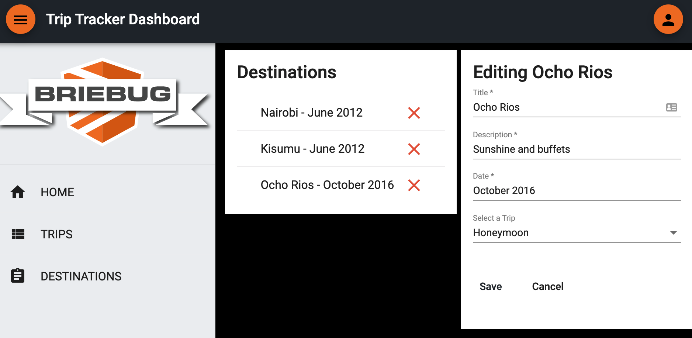

# Workout Dashboard

This project was generated using [Nx](https://nx.dev).



## App Description

This is the last of 8 Accelerated Angular LevelUp Applications.
It aims to show a complex feature set/data model for a fully reactive, unit tested, E2E tested, well architected Angular application.

Specifically, this dashboard app features CRUD functionality on two entities - Trips and Destinations...

```json
"trips": [
    {
      "id": "008e37dc-02c8-4173-9312-bfa7cf4bb8c3",
      "title": "Kenya",
      "description": "Mission Trip",
      "date": "June 2012",
      "destinations": [
        {
          "id": "923718fd-f84c-4abb-8e72-f8fc6f51253e",
          "title": "Nairobi",
          "description": "Stayed with friends",
          "date": "June 2012",
          "tripId": "008e37dc-02c8-4173-9312-bfa7cf4bb8c3"
        },
        {
          "id": "95e65c7a-1aad-4c9f-9ed9-e7a4d873838f",
          "title": "Kisumu",
          "description": "Played music for kids",
          "date": "June 2012",
          "tripId": "008e37dc-02c8-4173-9312-bfa7cf4bb8c3"
        }
      ]
    }
]
```

Keep track of all the places you went on all of your trips.

## See It Live

[Visit Trip Tracker Dashboard](https://levelup-angular-08-trips.surge.sh/)

## Getting Started

Run `npm install`.

## Development server

Run `npm run serve:all` for a dev server and to run the json-server api. Navigate to http://localhost:4200/. The app will automatically reload if you change any of the source files.

## Build

Run `ng build dashboard` to build the project. The build artifacts will be stored in the `dist/` directory. Use the `--prod` flag for a production build.

## Understand your workspace

Run `nx dep-graph` to see a diagram of the dependencies of your projects.
